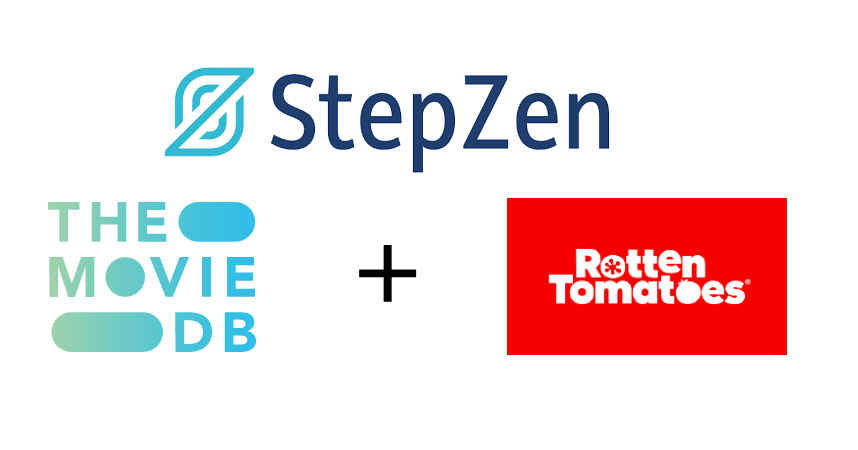

## StepZen 101



An example showing how to use StepZen connected with Movie DB + Rotten Tomatoes

### Requirements:

- [StepZen Account](https://stepzen.com)
- [StepZen cli](https://stepzen.com/docs/quick-start/install-and-setup)
- [Movie DB Account](https://developers.themoviedb.org/3/getting-started/introduction)

### On CodeSandbox

You can fork this CodeSandbox by clicking the fork button on the top right. You need to add two [secret keys](https://codesandbox.io/docs/secrets) to the CodeSandbox:

- `STEPZEN_USERNAME`: Your StepZen username
- `STEPZEN_ADMIN_KEY`: The admin key from your StepZen account
- `MOVIE_DB_API_KEY`: The API key from your Movie DB account

### On your own device

From your own IDE you need to rename the file `.env.example` to `.env` and add your own credentials.

Before you're able to try out this example, you need to make sure that StepZen is installed on your local machine and that you're logged in. You can find how to do this in the [Getting Started with StepZen](https://stepzen.com/docs/quick-start) guide.

After cloning this repository you need to run the following command to start this example:

```
stepzen start
```

This will make a GraphQL API available at [http://localhost:5000/api/api/codesandbox](http://localhost:5000/api/codesandbox) with the GraphiQL Playground.
